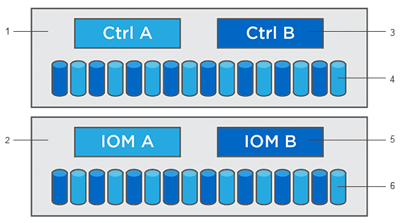

= Upgrades von Controller-Software und Firmware
:allow-uri-read: 
:experimental: 
:icons: font
:imagesdir: ../media/

[role="lead"]
Sie können die Software und die Firmware Ihres Speicherarrays für alle neuesten Funktionen und Fehlerbehebungen aktualisieren.

== Komponenten, die in Upgrades der SANtricity OS Controller-Software enthalten sind

Mehrere Storage-Array-Komponenten enthalten Software oder Hardware, die ein gelegentlich Upgrade durchgeführt werden soll.

* *Management Software* -- System Manager ist die Software, die das Speicher-Array verwaltet.
* *Controller-Firmware* -- Controller-Firmware verwaltet den I/O zwischen Hosts und Volumes.
* *Controller NVSRAM* -- Controller NVSRAM ist eine Controller-Datei, die die Standardeinstellungen für die Controller angibt.
* *IOM-Firmware* -- die I/O-Modul-Firmware (IOM) verwaltet die Verbindung zwischen einem Controller und einem Festplatten-Shelf. Es überwacht auch den Status der Komponenten.
* *Supervisor Software* -- Supervisor Software ist die virtuelle Maschine auf einem Controller, in dem die Software ausgeführt wird.

^1^ Controller-Shelf; ^2^ Festplatten-Shelf; ^3^ Software, Controller-Firmware, Controller NVSRAM Supervisor-Software; ^4^ Laufwerk-Firmware; ^5^ IOM-Firmware; ^6^ Laufwerk-Firmware

Sie können Ihre aktuellen Software- und Firmware-Versionen im Dialogfeld *Software- und Firmware-Bestandsaufnahme* anzeigen. Gehen Sie zu menu:Support[Upgrade Center] und klicken Sie dann auf den Link für *Software- und Firmware-Bestandsaufnahme*.

Im Rahmen des Upgrades muss möglicherweise auch der Multipath-/Failover-Treiber und/oder der HBA-Treiber des Hosts aktualisiert werden, damit der Host mit den Controllern korrekt interagieren kann. Informationen zum ermitteln, ob dies der Fall ist, finden Sie im https://imt.netapp.com/matrix/#welcome["Netapp Interoperabilitäts-Matrix-Tool"^].

== Wann I/O gestoppt werden soll

Wenn Ihr Storage Array zwei Controller enthält und Sie einen Multipath-Treiber installiert haben, kann das Storage Array die I/O-Verarbeitung während des Upgrades fortsetzen. Während des Upgrades führt Controller A alle seine Volumes an Controller B durch, aktualisiert seine Volumes und alle Volumes von Controller B und führt dann ein Upgrade für Controller B durch

== Zustandsprüfung vor dem Upgrade

Im Rahmen des Upgrades wird eine Integritätsprüfung vor dem Upgrade ausgeführt. Bei der Integritätsprüfung vor dem Upgrade werden alle Komponenten des Storage Arrays bewertet, um sicherzustellen, dass das Upgrade fortgesetzt werden kann. Die folgenden Bedingungen können das Upgrade verhindern:

* Ausgefallene zugewiesene Laufwerke
* Hot Spares werden verwendet
* Unvollständige Volume-Gruppen
* Exklusive Vorgänge ausgeführt
* Fehlende Volumes
* Controller befindet sich im Status „nicht optimal“
* Übermäßige Anzahl von Ereignisprotokollereignissen
* Fehler bei der Validierung der Konfigurationsdatenbank
* Laufwerke mit alten Versionen von DACstore

Sie können die Integritätsprüfung vor dem Upgrade auch separat durchführen, ohne ein Upgrade durchführen zu müssen.
